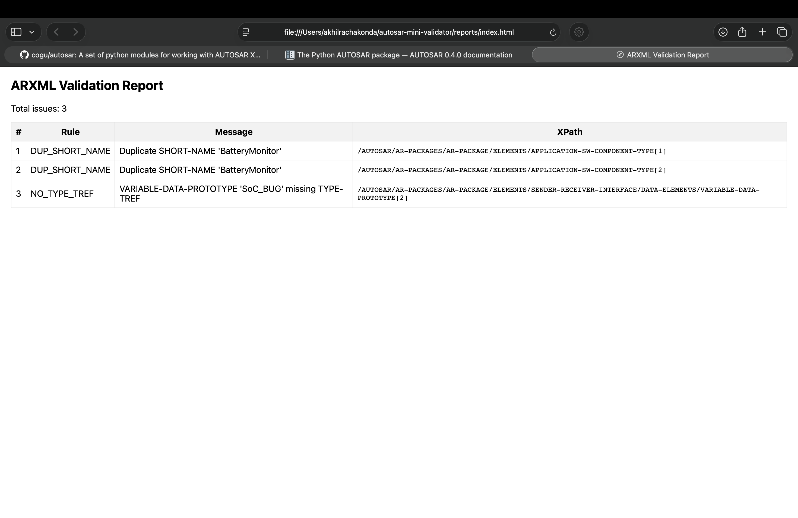

# AUTOSAR Mini Validator (Demo)

A lightweight Python proof-of-concept to validate AUTOSAR `.arxml` files.

### Rules Implemented
- **DUP_SHORT_NAME** – detects duplicate element names
- **NO_TYPE_TREF** – detects missing type references in `VARIABLE-DATA-PROTOTYPE`
- **COMPU_METHOD_INCOMPLETE** – detects missing `UNIT-REF` or `COMPU-SCALE` in computation methods

## 🖼️ Example Output

Below is the actual **HTML validation report** generated by the tool when validating `sample.arxml`:



> **Figure 1:** The tool detected 3 issues —  
> ① Two duplicate `SHORT-NAME` elements ("BatteryMonitor") and  
> ② One missing `TYPE-TREF` for the variable `SoC_BUG`.

The **XPath** column shows the exact location of each issue within the ARXML hierarchy,  
making it easy for engineers to fix data inconsistencies quickly.

### Run
```bash
python validator.py sample.arxml reports
